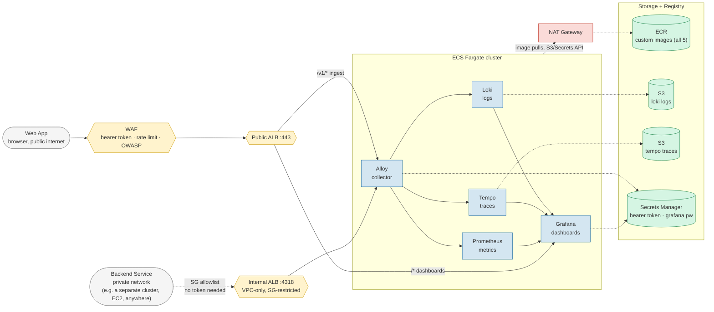

# Observability Infrastructure — ECS Fargate, No Kubernetes

Self-hosted Grafana LGTM stack (Loki, Tempo, Prometheus, Grafana) fronted by
Grafana Alloy as the OTLP telemetry collector. Deployed on AWS **ECS Fargate**
via a single Terraform root module — no Kubernetes.

This is the second implementation of the same observability platform in this
repo. [`observability-eks/`](../observability-eks) runs it on EKS as a
Kubernetes learning project. This one asks a different question: **the stack
itself never needs anything Kubernetes-specific — no pod scheduling, no
service discovery, no scaling logic — so what does it look like if you build
it on the simplest thing that can run five containers?**

## Two telemetry sources, two trust models

The stack is designed to receive telemetry from two kinds of senders that
have fundamentally different trust characteristics:

- **A web app** (browser) — public, untrusted, needs a bearer token to write
  telemetry, and the WAF has to assume anyone can reach it.
- **A backend service** — private, already inside your network (could be a
  separate Kubernetes cluster, a fleet of EC2 instances, another VPC via
  peering — anywhere with a network path). It doesn't need a bearer token
  because the security group is the entire trust boundary: only that backend
  service's traffic is allowed in.

Both **push** OTLP data to Alloy — Alloy never reaches back into either of
them. That one-way relationship is why this stack doesn't need to run
alongside the backend service on the same orchestrator. A second, VPC-internal
ALB gets the backend the "no public internet hop, no per-GB data-transfer
cost" benefit that co-locating on the same Kubernetes cluster would — without
requiring this stack to run on Kubernetes at all.

---

## Architecture



### How to read this diagram

**Two ALBs, not one, and not a Kubernetes Ingress.** The public ALB terminates
TLS, enforces the bearer token (via a WAF rule — same technique as
`observability-eks`), and is reachable from the internet. The internal ALB has
no WAF, no TLS, no token: it lives in private subnets, and its security group
only accepts traffic from the backend service's SG/CIDR. Two ALBs exist
because "public and internet-reachable" and "private and VPC-only" are
mutually exclusive properties of a single AWS ALB — you can't have one load
balancer be both. Both ALBs point at the **same Alloy target group**; Alloy
doesn't know or care which listener a request arrived through.

**WAF only guards the public ALB.** The internal ALB's perimeter is its
security group, not a token — anything that can reach it on the network layer
is already trusted (see [Security notes](#security-notes)).

**ECR holds custom images for all 5 services.** Unlike `observability-eks`
(which uses ConfigMaps for 3 services and Helm charts for 2), ECS Fargate has
no equivalent to a ConfigMap — the config file has to be baked into the image
at build time. `make build-images` builds and pushes all 5.

**NAT Gateway is for the Fargate tasks**, not the ALBs. Tasks in private
subnets need it to pull images from ECR and reach S3/Secrets Manager APIs
(the S3 gateway endpoint covers the S3 data-plane traffic itself, but the ECR
API and Secrets Manager calls still go out through NAT — see
[Cost](#cost) for why removing it isn't worth it here either, same
conclusion as `observability-eks`).

**Everything here is a single Terraform root module.** `observability-eks`
needed two stacks with separate state because the AWS Load Balancer
Controller (a pod inside the cluster) owns the ALB and Terraform never sees
it directly — that's a Kubernetes-specific problem. ECS has no such
controller: the ALBs, target groups, and services are all *directly*
Terraform resources. `terraform apply` and `terraform destroy` just work, in
one pass, with no stack-splitting or ordering workarounds required.

---

## What Gets Created

### AWS Resources

| Resource | Purpose |
|---|---|
| **VPC** | Public + private subnets across 2 AZs. NAT gateway for private egress. |
| **S3 gateway endpoint** | Free. Keeps S3 traffic (Loki/Tempo writes, ECR image layers) off the NAT. |
| **ECS Cluster** | Fargate, no EC2 instances to manage. |
| **ECR × 5** | Custom images for Alloy, Loki, Tempo, Prometheus, Grafana — config baked in at build time. MUTABLE tags (deliberately, unlike observability-eks — see [Known gaps](#known-gaps)) |
| **S3 buckets × 2** | Loki log chunks (90-day lifecycle), Tempo trace blocks (30-day lifecycle) |
| **Secrets Manager × 2** | Bearer token for ingest auth, Grafana admin password |
| **IAM roles** | 1 shared ECS task execution role + per-service task roles (Loki→S3, Tempo→S3, Grafana→Secrets). Alloy and Prometheus get none — Alloy never reads the bearer token at runtime (WAF checks it directly from a Terraform-known value), Prometheus needs no AWS API access at all |
| **Cloud Map namespace** | Backs ECS Service Connect — how `loki:3100`, `tempo:4317`, `prometheus:9090`, `alloy:12345` resolve between containers, the ECS equivalent of Kubernetes' built-in cluster DNS |
| **Security groups × 7** | Public ALB, internal ALB, and one per service, each scoped to exactly what talks to it |
| **Public ALB** | TLS termination (if `domain_name` set), WAF, path-based routing (`/v1/*` → Alloy, `/*` → Grafana) |
| **Internal ALB** | VPC-only, SG-restricted, no WAF/TLS — the backend service's ingest path |
| **WAF Web ACL** | Attached to the public ALB only: bearer-token enforcement, OWASP managed rules, size limit, rate limit |
| **CloudWatch Log Groups × 5** | One per service, `awslogs` driver on each task definition |

### ECS Resources

| Resource | Count | Notes |
|---|---|---|
| Task definitions | 5 | Alloy, Loki, Tempo, Prometheus, Grafana — `awsvpc` network mode, Fargate |
| Services | 5 | Desired count 1 each; Alloy and Grafana register with ALB target groups, the rest are SG-only |
| Target groups | 2 | `alloy-tg` (shared by both ALBs), `grafana-tg` (public ALB only) |

### Config Files

Each service's config is baked into its own image via a `Dockerfile` that
`COPY`s the file from `configs/`. There's no ConfigMap or Helm chart
equivalent in ECS — this is the direct trade-off for not running Kubernetes.

| File | Owned by | Purpose |
|---|---|---|
| `configs/alloy/config.alloy` | Alloy | OTLP receiver → routes logs/traces/metrics to Loki/Tempo/Prometheus |
| `configs/loki/loki.yml.tpl` | Loki | S3 backend, retention, schema config — rendered by `configs.tf` (real bucket name/region baked in) before Docker ever builds |
| `configs/tempo/tempo.yml.tpl` | Tempo | S3 backend, retention, span metrics generator — rendered the same way |
| `configs/prometheus/prometheus.yml` | Prometheus | Scrape config, remote write receiver |
| `configs/grafana/datasources.yml` | Grafana | Loki + Tempo + Prometheus datasources, cross-linked |
| `configs/grafana/dashboards.yml` | Grafana | Dashboard auto-provisioning config |
| `configs/grafana/overview-dashboard.json` | Grafana | A sample dashboard to get started |

Inter-service hostnames (`loki`, `tempo`, `prometheus`, `alloy`) resolve via
**ECS Service Connect** — a Cloud Map namespace plus a sidecar proxy Terraform
attaches to each service (`ecs.tf`). It's the direct ECS substitute for what
Kubernetes gives you for free via cluster DNS.

## Data Flow

```
1. Web app sends OTLP with a bearer token → WAF checks the header on /v1/* →
   Public ALB → Alloy
2. Backend service sends OTLP directly → Internal ALB (its SG already proved
   trust) → same Alloy target group
3. Alloy routes:
   - Logs    → Loki (writes to S3 via its task role)
   - Traces  → Tempo (writes to S3 via its task role)
   - Metrics → Prometheus (local ephemeral storage)
4. Tempo generates RED metrics (span-metrics, service-graphs) → Prometheus
5. Grafana queries Loki, Tempo, Prometheus for dashboards and exploration
```

## File Structure

One root module — no stack split needed (see
[How to read this diagram](#how-to-read-this-diagram) for why).

```
observability-ecs/
├── README.md                # ← you are here
├── Makefile                 # init/plan/apply/destroy/build-images
├── .github/workflows/       # fmt + validate + tflint (runs once this is its own repo)
├── main.tf                  # terraform block + aws provider + default_tags
├── variables.tf
├── outputs.tf
├── vpc.tf                   # VPC, subnets, NAT, S3 gateway endpoint
├── ecr.tf                   # 5 private image repos (MUTABLE tags)
├── s3.tf                    # Loki + Tempo buckets
├── secrets.tf               # Generated bearer token + Grafana password
├── configs.tf                # Renders Loki/Tempo config templates with real bucket names
├── iam.tf                   # ECS execution role + per-service task roles
├── security-groups.tf       # Public ALB, internal ALB, and one per service
├── acm.tf                   # Optional TLS cert + Route53 alias for the public ALB
├── alb-public.tf            # Public ALB, target groups, listener rules
├── alb-internal.tf          # Internal ALB, shares the Alloy target group
├── waf.tf                   # WAF ACL (bearer-token rule + managed rules)
├── ecs.tf                   # Cluster, Service Connect namespace, 5 task defs, 5 services
├── docker/                  # One Dockerfile per service, config baked in
│   ├── alloy/Dockerfile
│   ├── loki/Dockerfile
│   ├── tempo/Dockerfile
│   ├── prometheus/Dockerfile
│   └── grafana/Dockerfile
└── configs/                 # Service configs, COPYed into images at build time
    ├── alloy/
    ├── loki/
    ├── tempo/
    ├── prometheus/
    └── grafana/
```

## Prerequisites

| Tool | Version | Check |
|---|---|---|
| Terraform | >= 1.9 | `terraform --version` |
| AWS CLI | v2 | `aws --version` |
| Docker | with buildx (bundled in recent Docker Desktop/Engine) | `docker buildx version` (for `make build-images`) |

Your AWS credentials need permissions for: VPC, ECS, ECR, EC2, S3, IAM,
Secrets Manager, WAF, ELB, ACM (if using a domain), CloudWatch Logs. Full
admin on a personal account is fine.

## Implementation Order

Each step builds on the previous one. Commit after each step.

| Step | Files | Creates |
|---|---|---|
| **1** | `main.tf`, `variables.tf`, `outputs.tf` | Provider config |
| **2** | `vpc.tf` | VPC, subnets, NAT, S3 gateway endpoint |
| **3** | `s3.tf` | Loki + Tempo buckets |
| **4** | `secrets.tf` | Bearer token + Grafana password |
| **5** | `ecr.tf` | 5 image repos |
| **6** | `configs/`, `docker/`, `configs.tf` | Config files, Dockerfiles, and Loki/Tempo template rendering |
| **7** | `iam.tf` | Execution role + per-service task roles |
| **8** | `security-groups.tf` | 7 security groups |
| **9** | `waf.tf`, `acm.tf`, `alb-public.tf` | Public ALB, optional TLS, WAF, target groups |
| **10** | `alb-internal.tf` | Internal ALB, sharing the Alloy target group |
| **11** | `ecs.tf` | Cluster, Service Connect namespace, task definitions, services |
| **12** | `Makefile` | `build-images`, `redeploy`, and the rest of the workflow |

## Deploying

```bash
make init

# First-time build — ECR repos must hold images before the services start
make apply           # creates the VPC/ECR/IAM/ALB/etc. (services will fail
                      # to start until images exist — that's expected)
make build-images    # builds all 5 from docker/, pushes to ECR
make redeploy         # forces new deployments so the services pick up images
```

`make output` prints the public endpoint, the internal ALB DNS name, and the
commands to retrieve the bearer token and Grafana password.

## Testing

```bash
ENDPOINT=$(terraform output -raw public_endpoint)
TOKEN=$(aws secretsmanager get-secret-value \
  --secret-id /obs-project/alloy-bearer-token \
  --query SecretString --output text)

# Grafana should respond
curl -o /dev/null -w "%{http_code}\n" "http://${ENDPOINT}/api/health"
# Expect: 200

# WAF blocks unauthenticated telemetry on the public path
curl -o /dev/null -w "%{http_code}\n" \
  -X POST "http://${ENDPOINT}/v1/traces" \
  -H "Content-Type: application/json" -d '{"resourceSpans":[]}'
# Expect: 403

# With the token, it's accepted
curl -o /dev/null -w "%{http_code}\n" \
  -X POST "http://${ENDPOINT}/v1/traces" \
  -H "Content-Type: application/json" \
  -H "Authorization: Bearer ${TOKEN}" \
  -d '{"resourceSpans":[]}'
# Expect: 200
```

The internal ALB has no public DNS/internet route by design — it can't be
curled from a laptop. Verifying it requires a resource inside the allowlisted
security group (an EC2 instance, a container task, anything you add to the
internal-ingress security group in `variables.tf`).

## Security notes

- **Ingest auth on the public path is enforced at WAF**, not in Alloy — same
  approach as `observability-eks`. Alloy has no native bearer-token
  validation and ALB has no built-in support for it, so a WAF rule blocks
  `/v1/*` requests that don't carry the exact `Authorization` header.
- **The internal ALB has no application-layer auth at all.** Its security
  group is the entire trust boundary. Anything that can reach it on the
  network is assumed to be the backend service. Scope the allowlisted SG/CIDR
  as tightly as your actual backend's network — not the whole VPC.
- **TLS is opt-in** via `domain_name`, same pattern as `observability-eks`.
  The internal ALB is plain HTTP unconditionally — it never leaves the VPC.
- **State contains secrets** in plaintext (bearer token, Grafana password).
  `.gitignore` keeps state out of git, but it's unencrypted on disk.

## Cleanup

```bash
make destroy
```

One `terraform destroy`, one pass. No stack-split, no ordering rule, no
controller to wait for — the entire point of not needing Kubernetes for a
push-only receiver.

## Cost

| Resource | Monthly |
|---|---|
| Fargate compute (3.5 vCPU / 7 GiB total across 5 tasks) | ~$126.00 |
| Public ALB | ~$18.00 |
| Internal ALB | ~$18.00 |
| NAT Gateway | ~$32.00 |
| WAF Web ACL | ~$6.00 |
| S3 (minimal data) | < $1.00 |
| ECR (5 images, ~2 GB) | < $1.00 |
| Secrets Manager (2 secrets) | $1.00 |
| **Total** | **~$202/month** |

**Honest comparison to `observability-eks` (~$190/mo): ECS is not cheaper
here.** Two things drive that: Fargate's per-vCPU/GB pricing is higher than
raw EC2 (the EKS project's node group costs ~$59/mo for the same rough
capacity vs ~$126/mo here), and this stack needs **two** ALBs by design (the
public/internal split is structural — one ALB can't be both internet-facing
and VPC-only), where the EKS project shares a single ALB across its ingress
paths. What ECS buys you instead is **operational simplicity**: no
Kubernetes to learn, no IRSA, no LB Controller, one Terraform root module, a
`terraform destroy` that always completes in one pass. It's a
complexity-for-cost trade, not a cost win — know which one you're actually
optimizing for before picking an orchestrator.

## Known gaps

- **All 5 images are custom-built**, unlike `observability-eks` where Loki
  and Tempo run from upstream Helm charts. ECS Fargate has no ConfigMap
  equivalent, so baking configs into images via Dockerfile is the direct
  substitute — more moving parts (5 Dockerfiles, a build step) for the same
  outcome.
- **No CI applies/destroys** — `.github/workflows/terraform.yml` runs
  `fmt`/`validate`/`tflint` only, same scope as `observability-eks`.
- **Single task per service, single AZ awareness** — fine for a side
  project; not highly available. Fargate services can run multiple tasks
  across AZs behind the same target group with no architecture change, just
  a `desired_count` bump.
- **Internal ALB's SG allowlist has to be maintained by hand** — if the
  backend service's network changes (new CIDR, new SG), `variables.tf` needs
  a matching update. There's no automatic discovery of "what counts as the
  backend" the way an EKS-based approach might get from cluster-native
  service discovery.
- **MUTABLE ECR tags, on purpose, with a trade-off.** Unlike
  `observability-eks`'s IMMUTABLE repos, a tag here can be silently
  overwritten by anyone who can push — necessary so editing a config file
  and rebuilding under the same version tag doesn't get rejected, but it
  means "the image behind `v1.17.0`" isn't a fixed, auditable thing over
  time the way it is on the EKS side.
- **ECS Service Connect is new surface area.** It's the direct substitute
  for Kubernetes' built-in cluster DNS, but it's an ECS-specific concept
  with its own configuration shape (`service{}` / `client_alias{}` blocks in
  `ecs.tf`) — there's no equivalent to point at if you already know
  Kubernetes DNS and are translating by analogy.

## What's Customizable

- **Sampling** — adjust trace sampling rate in `configs/alloy/config.alloy`
- **Retention** — `loki_retention_days` / `tempo_retention_days`
- **Task sizing** — CPU/memory per service in `ecs.tf`
- **Internal ingress allowlist** — `internal_ingress_cidr_blocks` in `variables.tf`
- **Dashboards / Alerts** — add to `configs/grafana/`
- **Domain / TLS** — set `domain_name` + `route53_zone_id` for HTTPS on the public ALB

## observability-ecs vs observability-eks

| | `observability-ecs` (this) | `observability-eks` |
|---|---|---|
| Orchestrator | ECS Fargate | Kubernetes (EKS) |
| Terraform layout | 1 root module | 2 stacks (platform + workloads) — required by the LB Controller owning AWS resources |
| Config delivery | Baked into images (Dockerfile) | ConfigMaps (3 services) + Helm chart values (2 services) |
| IAM model | ECS task roles | IRSA (OIDC + per-ServiceAccount trust policy) |
| Ingress | 2 ALBs, directly Terraform-managed | 1 shared ALB via AWS Load Balancer Controller + Ingress |
| Teardown | 1 `terraform destroy` | Ordered `workloads` → `platform` (documented gotcha) |
| Monthly cost | ~$202 | ~$190 |
| What it teaches | AWS-native container ops, dual-trust ingress patterns | Kubernetes: Deployments, Services, IRSA, Helm, Ingress controllers |
