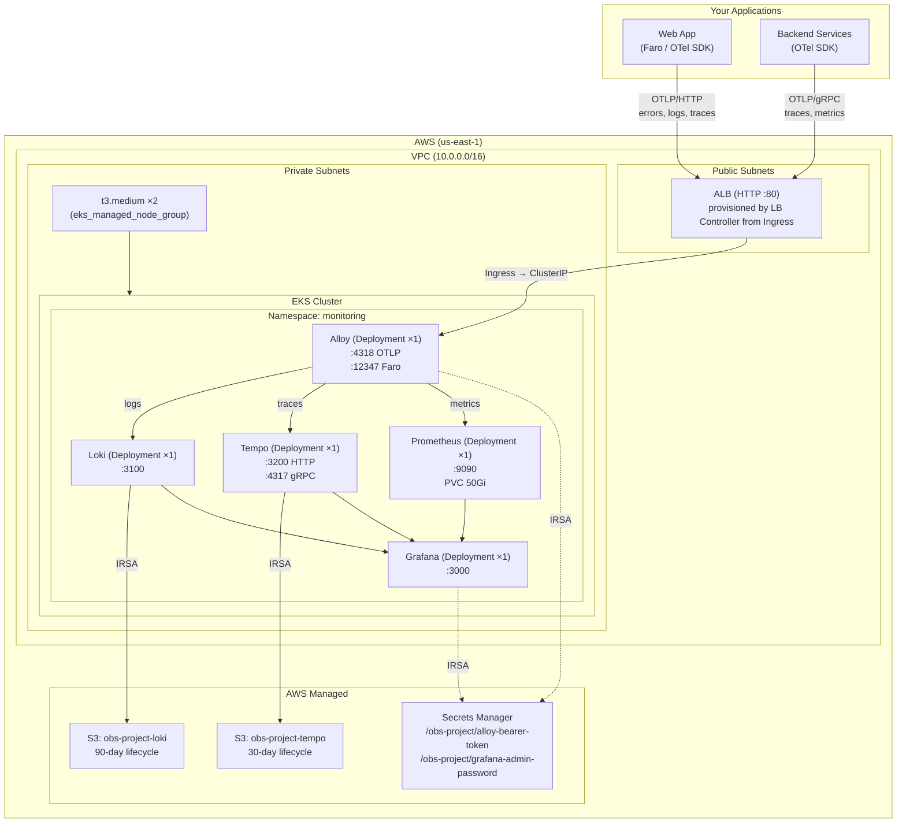

# Observability Infrastructure — Side Project

Self-hosted Grafana LGTM stack (Loki, Tempo, Prometheus, Grafana) fronted by
Grafana Alloy as the telemetry collector. Deployed on AWS EKS via Terraform.

This is a **personal side project** — a complete, reusable observability stack
that any application can point its telemetry SDK at. Think of it as your own
self-hosted Datadog/New Relic alternative.

---

## Architecture



## What Gets Created

### AWS Resources

| Resource | Purpose |
|---|---|
| **VPC** | Public + private subnets across 2 AZs. NAT gateway for private egress. |
| **EKS Cluster** | Kubernetes control plane. Manages all deployments, services, ingress. |
| **EKS Node Group** | 2× t3.medium EC2 instances in private subnets. |
| **S3: `obs-project-loki`** | Loki log chunk storage (90-day lifecycle) |
| **S3: `obs-project-tempo`** | Tempo trace block storage (30-day lifecycle) |
| **Secrets Manager ×2** | Bearer token for collector auth + Grafana admin password |
| **IAM Roles ×4** | IRSA: Loki→S3, Tempo→S3, Alloy→Secrets, Grafana→Secrets |
| **WAF Web ACL** (optional) | Rate limiting + OWASP rules on the ALB |

### Kubernetes Resources

| Resource | Kind | Replicas |
|---|---|---|
| `monitoring` | Namespace | — |
| `alloy-config`, `loki-config`, `tempo-config`, `prometheus-config` | ConfigMap | — |
| `grafana-datasources`, `grafana-dashboards-config`, `grafana-dashboard-config` | ConfigMap | — |
| `alloy-auth`, `grafana-auth` | Secret | — |
| `loki`, `tempo`, `alloy`, `grafana`, `prometheus` | ServiceAccount (IRSA) | — |
| `alloy`, `loki`, `tempo`, `prometheus`, `grafana` | Deployment | 1 |
| `alloy`, `loki`, `tempo`, `prometheus`, `grafana` | Service (ClusterIP) | — |
| `prometheus-data` | PersistentVolumeClaim (50Gi) | — |
| `alloy`, `grafana` | Ingress (shared ALB) | — |
| `aws-load-balancer-controller` | Helm Release | 2 pods |

### Config Files

Each service's configuration is stored locally in `configs/` and mounted as
ConfigMaps. These configs are cloud-agnostic — the same files work whether you
deploy to EKS, Docker Compose, or any other orchestrator.

| File | Owned by | Purpose |
|---|---|---|
| `configs/alloy/config.alloy` | Alloy | Telemetry routing: Faro/OTLP → Loki/Tempo/Prometheus |
| `configs/loki/loki.yml` | Loki | S3 backend, 90-day retention, schema config |
| `configs/tempo/tempo.yml` | Tempo | S3 backend, 30-day retention, span metrics generator |
| `configs/prometheus/prometheus.yml` | Prometheus | Scrape config, remote write receiver |
| `configs/grafana/datasources.yml` | Grafana | Loki + Tempo + Prometheus datasources with cross-linking |
| `configs/grafana/dashboards.yml` | Grafana | Dashboard auto-provisioning config |
| `configs/grafana/overview-dashboard.json` | Grafana | A sample dashboard to get started |

> Configs added during implementation steps. You can customize them for your
> own apps (CORS origins, sampling rates, alert thresholds, etc.).

## Data Flow

```
1. Your app's telemetry SDK (Faro for browser, OTel for backend) sends
   data to the Alloy collector endpoint (ALB hostname)
2. ALB → Alloy Service (ClusterIP) → Alloy pod
3. Alloy routes:
   - Logs → Loki (writes to S3 via IRSA)
   - Traces → Tempo (writes to S3 via IRSA)
   - Metrics → Prometheus (writes to PVC)
4. Tempo generates RED metrics (span-metrics, service-graphs) → Prometheus
5. Grafana queries Loki, Tempo, Prometheus for dashboards and exploration
```

## File Structure

```
observability/
├── README.md              # ← you are here
├── main.tf                # Providers, VPC module, EKS module
├── variables.tf           # All input variables with defaults
├── outputs.tf             # Cluster name, ALB hostname, S3 bucket names
├── s3.tf                  # 2 S3 buckets + lifecycle rules
├── secrets.tf             # 2 Secrets Manager secrets (auto-generated passwords)
├── iam.tf                 # 4 IRSA roles (Loki/Tempo → S3, Alloy/Grafana → Secrets)
├── kubernetes.tf          # Namespace, ConfigMaps, Secrets, Deployments, Services, PVC, Ingress
├── lb-controller.tf       # AWS Load Balancer Controller (Helm)
├── waf.tf                 # WAF Web ACL (optional)
├── configs/               # Service config files → mounted as ConfigMaps
│   ├── alloy/
│   ├── loki/
│   ├── tempo/
│   ├── prometheus/
│   └── grafana/
└── .terraform/            # Git-ignored — state and plugins
```

## Prerequisites

| Tool | Version | Check |
|---|---|---|
| Terraform | >= 1.5.0 | `terraform --version` |
| AWS CLI | v2 | `aws --version` |
| kubectl | >= 1.30 | `kubectl version --client` |
| Helm | >= 3.0 | `helm version` |

Your AWS credentials need permissions for: EKS, EC2, VPC, IAM, S3, Secrets Manager, WAF.
(Full admin on a personal account is fine.)

## Implementation Order

Each step builds on the previous one. Commit after each step.

| Step | Files | Creates | Approx Time |
|---|---|---|---|
| **1** | `main.tf`, `variables.tf`, `outputs.tf` | Provider config, variables, empty outputs | — |
| **2** | `s3.tf` | 2 S3 buckets + lifecycle rules | 1 min |
| **3** | `secrets.tf` | 2 Secrets Manager secrets | 30 sec |
| **4** | `iam.tf` | 4 IRSA IAM roles | 1 min |
| **5** | `main.tf` (VPC + EKS modules) | VPC, EKS cluster, node group | **25 min** |
| **6** | `configs/` files + `kubernetes.tf` (ConfigMaps + Secrets) | Namespace, configs, K8s secrets | 1 min |
| **7** | `kubernetes.tf` (Deployments + Services + PVC) | 5 deployments, 5 services, PVC | 2 min |
| **8** | `lb-controller.tf` | AWS Load Balancer Controller via Helm | 2 min |
| **9** | `kubernetes.tf` (Ingress) | ALB auto-provisioned | 3 min |
| **10** | `waf.tf` | WAF Web ACL (optional) | 1 min |

## Post-Deployment

```bash
# Get the ALB hostname
kubectl -n monitoring get ingress

# Output:
# NAME      CLASS   HOSTS   ADDRESS
# alloy     alb     *       k8s-monitori-alloy-abc123.us-east-1.elb.amazonaws.com
# grafana   alb     *       (same hostname — shared ALB)

# Open Grafana
open http://<alb-hostname>

# Get the admin password
aws secretsmanager get-secret-value \
  --secret-id /obs-project/grafana-admin-password \
  --query SecretString --output text
```

## Connecting Your Apps

Once the stack is running, point any application with OpenTelemetry or Faro
SDK support at the Alloy collector:

```js
// Example: Faro Web SDK (browser app)
initializeFaro({
  url: "http://<alb-hostname>",
  app: { name: "my-app", version: "1.0.0" },
});

// Example: OTel Python (backend service)
// OTEL_EXPORTER_OTLP_TRACES_ENDPOINT=http://<alb-hostname>/v1/traces
```

All telemetry — errors, logs, traces, Web Vitals — shows up in Grafana within
seconds.

## Cleanup

```bash
terraform destroy
# ~20 minutes to tear down everything
```

## Cost

| Resource | Monthly |
|---|---|
| EKS control plane | $73.00 |
| 2 × t3.medium EC2 | ~$59.00 |
| NAT Gateway | ~$32.00 |
| ALB | ~$18.00 |
| S3 (minimal data) | < $1.00 |
| Secrets Manager (2 secrets) | $1.00 |
| **Total** | **~$184/month** |

> Reduce cost: set `node_desired_size = 1`, use a single NAT Gateway.
> Run `terraform destroy` between sessions to avoid idle costs.

## What's Customizable

All infrastructure is in Terraform. Config files are plain YAML/Alloy.
You own the whole stack:

- **CORS** — add your app's domains to `configs/alloy/config.alloy`
- **Sampling** — adjust trace sampling rate (default 25%)
- **Retention** — change S3 lifecycle rules in `s3.tf`
- **Dashboards** — add your own Grafana dashboard JSONs
- **Alerts** — add alert rules in Grafana provisioning
- **Auth** — add bearer token validation, SSO, or IP whitelisting
- **Scaling** — increase node count or instance type in `main.tf`