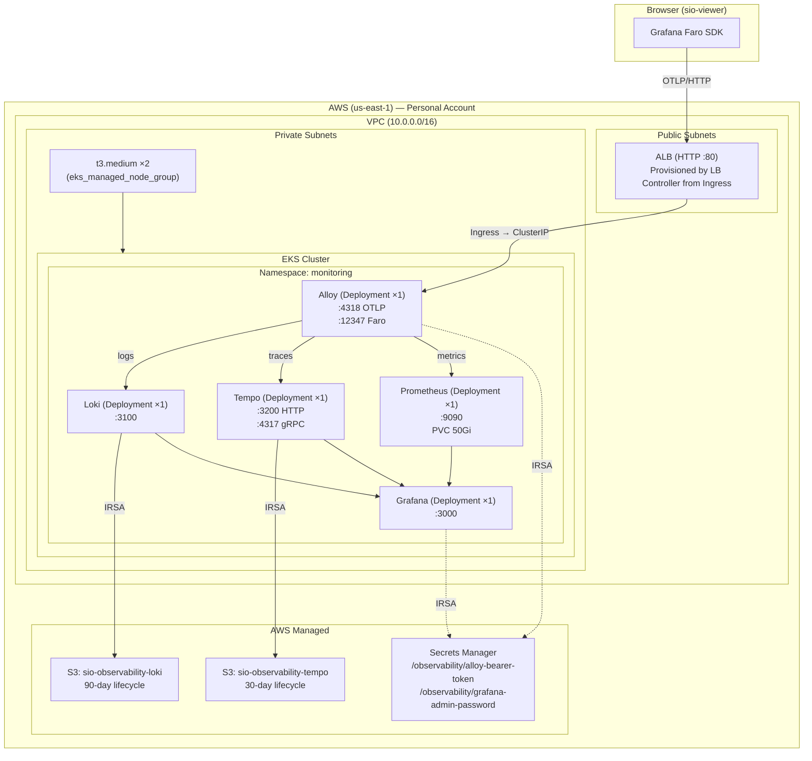

# Observability Infrastructure — Personal Reference Implementation

Self-hosted Grafana LGTM stack (Loki, Tempo, Prometheus, Grafana) fronted by
Grafana Alloy, deployed on AWS EKS via Terraform. This is a **personal-account
reference implementation** — the same Terraform code ports directly to the
company AWS account when the time comes.

**Production plan:** [sio-viewer/observability/PROD.md](../../sio-viewer/observability/PROD.md) — the canonical
production deployment guide this implementation is based on.

---

## Architecture



## What Gets Created

### AWS Resources (owned by Terraform)

| Resource | Purpose | Retention |
|---|---|---|
| **VPC** | Network isolation. Public + private subnets across 2 AZs. NAT gateway for private egress. | Persistent |
| **EKS Cluster** | Kubernetes control plane. Manages deployments, services, ingress. | Persistent |
| **EKS Managed Node Group** | 2× t3.medium EC2 instances in private subnets. Run all observability pods. | Persistent |
| **S3: `sio-observability-loki`** | Loki log chunk storage | 90 days |
| **S3: `sio-observability-tempo`** | Tempo trace block storage | 30 days |
| **Secrets Manager ×2** | Bearer token (Alloy auth) + Grafana admin password | Persistent |
| **IAM Roles ×4** | IRSA: Loki→S3, Tempo→S3, Alloy→Secrets, Grafana→Secrets | Persistent |
| **WAF Web ACL** (optional) | Rate limiting + OWASP rules on the ALB | Persistent |

### Kubernetes Resources (owned by Terraform `kubernetes` provider)

| Resource | Kind | Replicas |
|---|---|---|
| `monitoring` | Namespace | — |
| `alloy-config`, `loki-config`, `tempo-config`, `prometheus-config` | ConfigMap | — |
| `grafana-datasources`, `grafana-dashboards-config`, `grafana-dashboard-json` | ConfigMap | — |
| `alloy-auth` (bearer token), `grafana-auth` (admin password) | Secret | — |
| `loki`, `tempo`, `alloy`, `grafana`, `prometheus` | ServiceAccount (IRSA) | — |
| `alloy`, `loki`, `tempo`, `prometheus`, `grafana` | Deployment | 1 |
| `alloy`, `loki`, `tempo`, `prometheus`, `grafana` | Service (ClusterIP) | — |
| `prometheus-data` | PersistentVolumeClaim | — |
| `alloy`, `grafana` | Ingress (ALB) | — |
| `aws-load-balancer-controller` | Helm Release | 2 (controller pods) |

### Config Files (mounted from sio-viewer repo)

The same config files from the local Docker Compose stack are used. They are
**cloud-agnostic** — the only difference between local and production is the
storage backend (local filesystem → S3) and CORS origins (localhost → empty
since we use ALB hostname).

| Config | Source | Mounted To |
|---|---|---|
| `config.alloy` | `sio-viewer/observability/alloy/config.alloy` | `/etc/alloy/config.alloy` |
| `loki.yml` | `sio-viewer/observability/loki/loki.yml` | `/etc/loki/loki.yml` |
| `tempo.yml` | `sio-viewer/observability/tempo/tempo.yml` | `/etc/tempo/tempo.yml` |
| `prometheus.yml` | `sio-viewer/observability/prometheus/prometheus.yml` | `/etc/prometheus/prometheus.yml` |
| `datasources.yml` | `sio-viewer/observability/grafana/provisioning/datasources/datasources.yml` | `/etc/grafana/provisioning/datasources/` |
| `dashboards.yml` | `sio-viewer/observability/grafana/provisioning/dashboards/dashboards.yml` | `/etc/grafana/provisioning/dashboards/` |
| `sio-viewer-overview.json` | `sio-viewer/observability/grafana/provisioning/dashboards/sio-viewer-overview.json` | `/etc/grafana/provisioning/dashboards/json/` |

## Data Flow

```
1. Faro SDK (sio-viewer browser) captures errors, logs, Web Vitals, XHR traces
2. Browser → ALB (HTTP) → Alloy Service → Alloy pod
3. Alloy routes:
   - Logs → Loki (writes to S3 via IRSA)
   - Traces → Tempo (writes to S3 via IRSA)
   - Metrics → Prometheus (writes to PVC)
4. Tempo generates RED metrics (span-metrics, service-graphs) → Prometheus
5. Grafana queries Loki, Tempo, Prometheus for dashboards
```

## File Structure

```
observability/
├── README.md              # ← you are here
├── main.tf                # Providers, VPC module, EKS module, backend config
├── variables.tf           # All input variables with defaults
├── outputs.tf             # Cluster name, ALB hostname, S3 bucket names
├── s3.tf                  # 2 S3 buckets + public access blocks + lifecycle rules
├── secrets.tf             # 2 Secrets Manager secrets (bearer token, grafana password)
├── iam.tf                 # 4 IRSA roles (Loki, Tempo, Alloy, Grafana)
├── kubernetes.tf          # Namespace, ConfigMaps, Secrets, SAs, Deployments, Services, PVC, Ingress
├── lb-controller.tf       # AWS Load Balancer Controller Helm install
├── waf.tf                 # WAF Web ACL (optional)
└── .terraform/            # Git-ignored — Terraform state and provider plugins
```

## Prerequisites

| Tool | Version | Check |
|---|---|---|
| Terraform | >= 1.5.0 | `terraform --version` |
| AWS CLI | v2 | `aws --version` |
| kubectl | >= 1.30 | `kubectl version --client` |
| Helm | >= 3.0 | `helm version` |

Your AWS credentials (personal account) must have permissions to create:
- EKS, EC2, VPC, IAM, S3, Secrets Manager, WAF
- (Full admin on a personal account is fine)

## Implementation Order

Each step builds on the previous one. Commit after each step.

| Step | File(s) | What It Creates | Approx Time |
|---|---|---|---|
| **1** | `main.tf`, `variables.tf`, `outputs.tf` | Provider config, variables, empty outputs | — |
| **2** | `s3.tf` | 2 S3 buckets + lifecycle rules | 1 min |
| **3** | `secrets.tf` | 2 Secrets Manager secrets | 30 sec |
| **4** | `iam.tf` | 4 IRSA IAM roles | 1 min |
| **5** | `main.tf` (VPC + EKS modules) | VPC, EKS cluster, node group | **25 min** |
| **6** | `kubernetes.tf` (ConfigMaps + Secrets) | Namespace, ConfigMaps, K8s Secrets | 1 min |
| **7** | `kubernetes.tf` (ServiceAccounts + Deployments + Services + PVC) | 5 deployments, 5 services, PVC | 2 min |
| **8** | `lb-controller.tf` | AWS Load Balancer Controller via Helm | 2 min |
| **9** | `kubernetes.tf` (Ingress) | ALB provisioned automatically | 3 min |
| **10** | `waf.tf` | WAF Web ACL (optional) | 1 min |

## Post-Deployment

```bash
# Get the ALB hostname
kubectl -n monitoring get ingress

# Output looks like:
# NAME      CLASS   HOSTS   ADDRESS
# alloy     alb     *       k8s-monitori-alloy-abc123.us-east-1.elb.amazonaws.com
# grafana   alb     *       k8s-monitori-grafana-abc123.us-east-1.elb.amazonaws.com

# Both share the same ALB (group.name), so the hostname is the same.
# Open Grafana:
open http://<alb-hostname>

# Get the admin password:
aws secretsmanager get-secret-value \
  --secret-id /sio-observability/grafana-admin-password \
  --query SecretString --output text
```

## Cleanup

```bash
terraform destroy
# ~20 minutes to tear down EKS + VPC + all resources
```

## Cost (Personal Account)

| Resource | Monthly |
|---|---|
| EKS control plane | $73.00 |
| 2 × t3.medium EC2 | ~$59.00 |
| NAT Gateway | ~$32.00 |
| ALB | ~$18.00 |
| S3 (minimal data) | < $1.00 |
| Secrets Manager (2 secrets) | $1.00 |
| **Total** | **~$184/month** |

> **Reduce cost for testing:** Set `node_desired_size = 1` and use a single
> NAT Gateway instead of one per AZ. Run `terraform destroy` between sessions
> to avoid idle costs.

## Relationship to sio-viewer PROD.md

| Aspect | PROD.md (Company Account) | This Repo (Personal Account) |
|---|---|---|
| **Purpose** | Production deployment guide | Reference implementation + learning |
| **Orchestration** | EKS (same cluster as sio-api) | EKS (dedicated cluster) |
| **Domain** | `alloy.satelytics.io`, `grafana.satelytics.io` | ALB auto-generated hostname |
| **TLS** | ACM certs + HTTPS | HTTP only (no custom domain) |
| **Auth** | Bearer token on Alloy | Bearer token on Alloy (same) |
| **Storage** | S3 + PVC | S3 + PVC (same) |
| **Configs** | Same config files from sio-viewer repo | Same config files from sio-viewer repo |
| **WAF** | Enabled | Optional |
| **DNS** | Route 53 records | None |
| **IRSA** | `eksctl create iamserviceaccount` | Terraform `aws_iam_role` + trust policy |
| **Infra as Code** | Manual + PROD.md instructions | Full Terraform — portable to any account |

## Next Steps

After `terraform apply` succeeds:

1. Point sio-viewer's `FARO_COLLECTOR_URL` at the Alloy ALB hostname
2. Set `FARO_INGEST_TOKEN` to the bearer token from Secrets Manager
3. Build and deploy sio-viewer
4. Verify telemetry in Grafana

See [sio-viewer PROD.md §10](../../sio-viewer/observability/PROD.md#10-verification-checklist)
for the full verification checklist.