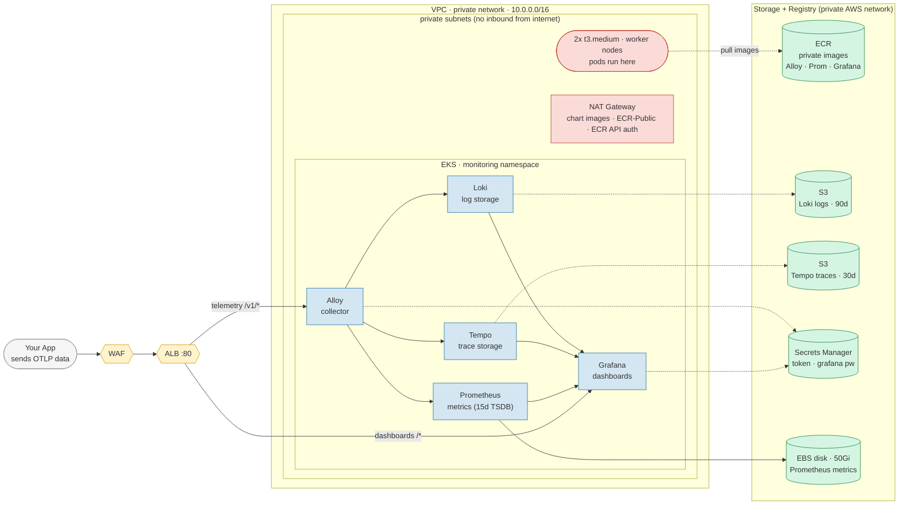

# Observability Infrastructure — Side Project

Self-hosted Grafana LGTM stack (Loki, Tempo, Prometheus, Grafana) fronted by
Grafana Alloy as the OTLP telemetry collector. Deployed on AWS EKS via Terraform.

This is a **personal side project** focused purely on the observability
**platform itself** — provisioning, wiring, and operating the infrastructure.
There's no sample app attached; the pipeline is validated with synthetic OTLP
test data instead.

---

## Architecture


```mermaid
flowchart LR
    Client(["Your App\nsends OTLP data"]):::ext

    WAF{{"WAF"}}:::edge
    ALB{{"ALB :80"}}:::edge
    Client --> WAF --> ALB

    subgraph VPC["VPC · private network · 10.0.0.0/16"]
        subgraph private["private subnets (no inbound from internet)"]
            NAT["NAT Gateway\nchart images · ECR-Public · ECR API auth"]:::net

            subgraph EKS["EKS · monitoring namespace"]
                direction LR
                Alloy["Alloy\ncollector"]:::compute
                Loki["Loki\nlog storage"]:::compute
                Tempo["Tempo\ntrace storage"]:::compute
                Prom["Prometheus\nmetrics (15d TSDB)"]:::compute
                Graf["Grafana\ndashboards"]:::compute
                Alloy --> Loki & Tempo & Prom
                Loki & Tempo & Prom --> Graf
            end

            Nodes(["2x t3.medium · worker nodes\npods run here"]):::net
        end
    end

    ALB -- "telemetry /v1/*" --> Alloy
    ALB -- "dashboards /*" --> Graf

    subgraph store["Storage + Registry (private AWS network)"]
        ECR[("ECR\nprivate images\nAlloy · Prom · Grafana")]:::storage
        S3L[("S3\nLoki logs · 90d")]:::storage
        S3T[("S3\nTempo traces · 30d")]:::storage
        SM[("Secrets Manager\ntoken · grafana pw")]:::storage
        PVC[("EBS disk · 50Gi\nPrometheus metrics")]:::storage
    end

    Nodes -. pull images .-> ECR
    Loki -.-> S3L
    Tempo -.-> S3T
    Alloy -.-> SM
    Graf -.-> SM
    Prom --> PVC

    classDef ext fill:#f5f5f5,stroke:#999,color:#333
    classDef edge fill:#fff3cd,stroke:#cc9a06,color:#333
    classDef compute fill:#d4e6f1,stroke:#2874a6,color:#333
    classDef net fill:#fadbd8,stroke:#c0392b,color:#333
    classDef storage fill:#d5f5e3,stroke:#1e8449,color:#333
```

### How to read this diagram

**Solid arrows** = your app's telemetry data flowing through the stack in real time.
Your app sends OTLP → WAF validates it → ALB routes it → Alloy fans it out →
Loki/Tempo/Prometheus store it → Grafana reads it all back for dashboards.

**Dotted arrows** = IRSA (IAM Roles for Service Accounts). Each Kubernetes pod
gets its own AWS IAM role, scoped to exactly what it needs. Loki can only touch
its S3 bucket; Tempo can only touch its own; Alloy can only read the bearer
token secret; Grafana can only read its admin password. Prometheus has no AWS
permissions at all — it doesn't need any.

**EBS disk (50Gi)** = Prometheus stores 15 days of time-series metrics on a disk
that must survive pod restarts. Without it, every restart wipes all metrics
history. This is provisioned as a Kubernetes PVC backed by an AWS EBS volume.

**Why EBS and not S3?** Prometheus opens files, seeks around inside them, and
writes a few bytes at a time to write-ahead logs — these are POSIX filesystem
operations that S3 can't do (S3 works like a file cabinet: you put whole
objects in and pull whole objects out). Loki and Tempo *can* use S3 because
they only write complete, immutable blocks. Prometheus needs a real filesystem,
so it gets a virtual hard drive (EBS) mounted into its pod. The S3-compatible
alternative is Grafana Mimir, but it's multiple services and overkill for a
single-node stack.

**ECR (private image registry)** = the three images this stack builds directly
(Alloy, Prometheus, Grafana) are mirrored into your own private ECR repos rather
than pulled from Docker Hub at runtime. This is the company pattern: no Docker
Hub rate limits, CVE scanning on push, and images that live in your account. The
worker nodes pull from ECR; the layer download rides the free S3 gateway
endpoint, and only the ECR API auth call goes out via NAT. Mirror them once with
`make push-images`. (Loki and Tempo are installed by Helm charts that manage
their own images and still pull upstream.)

**NAT Gateway** = the exit door for the private subnets. Even with ECR, a few
things still need outbound internet: the ECR API auth handshake, the Helm charts'
upstream images (Loki, Tempo, and the Loki chart's sidecar), and the AWS Load
Balancer Controller image, which lives on **ECR Public** — a registry no VPC
endpoint can reach. Removing the NAT entirely means mirroring all of those too
and adding interface endpoints for ECR-API/STS/EC2, which costs *more* than the
NAT — a security/air-gap choice, not a cost saving. So the NAT stays.

**S3 gateway endpoint** = a free VPC endpoint that keeps all S3 traffic on AWS's
private network instead of routing it through the NAT. Two things ride it:
Loki/Tempo reading and writing their buckets, and the image layers ECR serves
from S3. It also trims NAT data-processing charges.

**VPC** = a private network that isolates everything. Public subnets hold only
the ALB — the single door from the internet. Private subnets hold everything
else — the worker nodes, all pods, and the NAT Gateway. Nothing in the private
subnets can be reached directly from the internet.

**Node group (2 × t3.medium)** = the EC2 instances where Kubernetes schedules
your pods. Five observability services share two machines, each with 2 vCPU and
4 GiB of RAM.

**WAF** = blocks requests that shouldn't reach the stack. Enforces the bearer
token on telemetry ingest paths (`/v1/*`), blocks payloads over 1 MB, and
applies rate limiting. Grafana's own paths (`/`) are unaffected — it has its
own login.

**ALB** = the single entry point. Created automatically by the AWS Load Balancer
Controller (a pod running inside the cluster that watches Kubernetes Ingress
objects), not by Terraform directly. Routes `/v1/*` to Alloy and everything else
to Grafana.

## Stack layout

The infrastructure is split into two Terraform stacks with separate state.

| Stack | Owns | Providers |
|---|---|---|
| `platform/` | VPC, EKS, IAM, S3 data buckets, ECR repos, S3 gateway endpoint, Secrets Manager, WAF, ACM | `aws` |
| `workloads/` | Namespace, ConfigMaps, Deployments, Services, PVC, Ingress, LB Controller | `kubernetes`, `helm`, `aws` |

Both keep state locally. This stack is a monitoring environment that gets stood up
and torn down between sessions by one person, so there is no team to lock against
and nothing worth keeping a version history of. `workloads/` reads `platform/`'s
outputs straight out of its sibling state file.

**This split is the point, not an organisational preference.** Two concrete
problems come from putting them together:

A provider configured from a resource in its own state is unsound. When the
`kubernetes` provider was initialised from `module.eks` outputs in the same root
module, Terraform had to know the cluster endpoint before it could plan the
resources that create the cluster.

More visibly, the teardown deadlocked. Deleting an Ingress isn't a delete — it's a
handshake. Terraform removes the object, the controller notices, tears down the
ALB, and only then clears its finalizer. That needs the controller alive. But the
Ingresses only depended on the EKS *cluster*, not the node group, so Terraform was
free to destroy the node group in parallel and kill the controller mid-handshake.
The result was a destroy that hung on a finalizer nothing could clear, an ALB
pinning ENIs into the subnets so the VPC could never delete, and a namespace stuck
`Terminating`.

With the stacks split, `terraform destroy` on `workloads/` removes the Ingresses
while the cluster and controller are fully healthy, the controller cleans up its
own ALB exactly as designed, and destroying `platform/` afterwards finds nothing
left behind. Ordering is enforced by the `Makefile`, so it isn't something you
have to remember.

## What Gets Created

### AWS Resources — `platform/`

| Resource | Purpose |
|---|---|
| **VPC** | Public + private subnets across 2 AZs. NAT gateway for private egress. |
| **S3 gateway endpoint** | Free. Keeps S3 + ECR-layer traffic on AWS's private network. |
| **EKS Cluster** | Kubernetes control plane. |
| **EKS Node Group** | 2× t3.medium EC2 instances in private subnets. |
| **ECR ×3** | Private image registry for Alloy, Prometheus, Grafana (populated by `make push-images`) |
| **S3: `obs-project-loki`** | Loki log chunk storage (90-day lifecycle) |
| **S3: `obs-project-tempo`** | Tempo trace block storage (30-day lifecycle) |
| **Secrets Manager ×2** | Bearer token for ingest auth + Grafana admin password |
| **IAM Roles ×6** | IRSA: Loki→S3, Tempo→S3, Alloy→Secrets, Grafana→Secrets, EBS CSI, LB Controller |
| **WAF Web ACL** | Bearer token enforcement on ingest, rate limiting, OWASP rules, 1 MB body cap |
| **ACM Certificate** | HTTPS on the ALB — only when `domain_name` is set |

### Kubernetes Resources — `workloads/`

| Resource | Kind | Replicas |
|---|---|---|
| `monitoring` | Namespace | — |
| `alloy-config`, `prometheus-config` | ConfigMap | — |
| `grafana-datasources`, `grafana-dashboards-config`, `grafana-dashboard-json` | ConfigMap | — |
| `alloy-auth`, `grafana-auth` | Secret | — |
| `loki`, `tempo`, `alloy`, `grafana`, `prometheus` | ServiceAccount (IRSA) | — |
| `alloy`, `prometheus`, `grafana` | Deployment | 1 |
| `loki`, `tempo` | Helm release (StatefulSet) | 1 |
| `alloy`, `prometheus`, `grafana` | Service (ClusterIP) | — |
| `prometheus-data` (50Gi), `loki` (10Gi, chart-managed) | PersistentVolumeClaim | — |
| `gp3` | StorageClass | — |
| `alloy`, `grafana` | Ingress (shared ALB) | — |
| `aws-load-balancer-controller` | Helm Release | 2 pods |

### Config Files

Each service's configuration lives in `workloads/configs/` and is mounted as a
ConfigMap. These configs are cloud-agnostic — the same files work whether you
deploy to EKS, Docker Compose, or any other orchestrator.

| File | Owned by | Purpose |
|---|---|---|
| `configs/alloy/config.alloy` | Alloy | OTLP receiver → routes logs/traces/metrics to Loki/Tempo/Prometheus |
| `configs/prometheus/prometheus.yml` | Prometheus | Scrape config, remote write receiver |
| `configs/grafana/datasources.yml` | Grafana | Loki + Tempo + Prometheus datasources with cross-linking |
| `configs/grafana/dashboards.yml` | Grafana | Dashboard auto-provisioning config |
| `configs/grafana/overview-dashboard.json` | Grafana | A sample dashboard to get started |

> Loki and Tempo have no config files here — their configuration is rendered by
> their Helm charts from values in `helm.tf`.

## Data Flow

```
1. An OTLP client sends logs/traces/metrics to the ingest endpoint, with an
   Authorization: Bearer <token> header
2. WAF validates the header on /v1/* → ALB → Alloy Service → Alloy pod
3. Alloy routes:
   - Logs    → Loki (writes to S3 via IRSA)
   - Traces  → Tempo (writes to S3 via IRSA)
   - Metrics → Prometheus (writes to PVC)
4. Tempo generates RED metrics (span-metrics, service-graphs) → Prometheus
5. Grafana queries Loki, Tempo, Prometheus for dashboards and exploration
```

## File Structure

This project is self-contained — nothing here refers to a parent directory, so it
can be moved into its own repository as-is.

```
observability/
├── README.md                # ← you are here
├── Makefile                 # Ordered apply/destroy across the stacks below
├── .github/workflows/       # fmt + validate + tflint (runs once this is its own repo)
├── platform/                # AWS only — no kubernetes/helm provider
│   ├── main.tf              # terraform block + aws provider + default_tags
│   ├── eks.tf               # VPC + EKS cluster + managed node group
│   ├── iam.tf               # IRSA roles
│   ├── s3.tf                # Loki + Tempo buckets, lifecycle, encryption
│   ├── ecr.tf               # Private image repos (alloy, prometheus, grafana)
│   ├── vpc-endpoints.tf     # Free S3 gateway endpoint
│   ├── secrets.tf           # Generated bearer token + Grafana password
│   ├── waf.tf               # WAF ACL incl. bearer token enforcement
│   ├── acm.tf               # Optional TLS certificate
│   ├── variables.tf
│   └── outputs.tf           # Contract consumed by workloads/
└── workloads/               # Everything in-cluster
    ├── main.tf              # Providers, from an EKS data source
    ├── remote-state.tf      # Reads platform's state file + secret values
    ├── kubernetes.tf        # Namespace, ConfigMaps, Secrets, ServiceAccounts
    ├── workloads.tf         # StorageClass, PVC, Deployments, Services (Alloy/Grafana/Prometheus)
    ├── helm.tf              # Loki + Tempo via upstream Grafana charts
    ├── lb-controller.tf     # AWS Load Balancer Controller (Helm)
    ├── ingress.tf           # Shared-ALB Ingresses
    ├── dns.tf               # Route53 alias record (when TLS enabled)
    ├── variables.tf
    ├── outputs.tf
    └── configs/             # Alloy / Prometheus / Grafana configs → ConfigMaps
```

## Prerequisites

| Tool | Version | Check |
|---|---|---|
| Terraform | >= 1.9 | `terraform --version` |
| AWS CLI | v2 | `aws --version` |
| kubectl | >= 1.30 | `kubectl version --client` |
| Helm | >= 3.0 | `helm version` |
| skopeo | any recent | `skopeo --version` (for `make push-images`) |
| Docker | any recent | `docker version` (needed on macOS, skopeo delegates some operations to it) |

Terraform 1.9 is required because `route53_zone_id`'s validation block references
another variable, which older versions reject.

Your AWS credentials need permissions for EKS, EC2, VPC, IAM, S3, Secrets
Manager, WAF, ACM and Route53. Full admin on a personal account is fine.

## Deploying

From this directory (`observability/`). Docker must be running (for
`push-images`).

```bash
make init

# First-time build — the ECR repos must be populated before the pods that
# pull from them start, so run the three steps in order:
make apply-platform   # ~25 min, mostly EKS; also creates the ECR repos
make push-images      # mirror Alloy/Prometheus/Grafana images into ECR
make apply-workloads  # ~5 min; pods pull from ECR

# Subsequent runs (images already in ECR) can use the combined target:
make apply
```

`make apply-workloads` (and `make apply`) print the endpoint and the commands
for retrieving credentials when they finish.

### Recommended settings

Both default to the permissive option, so set them explicitly:

```hcl
# platform/terraform.tfvars

# Without this, the Grafana password and all telemetry cross the internet in
# plaintext. Requires a Route53-hosted domain.
domain_name     = "example.com"
route53_zone_id = "Z0123456789ABCDEFGHIJ"

# Without this, your Kubernetes API server accepts connection attempts from
# anywhere. `curl -s https://checkip.amazonaws.com` prints your address.
cluster_endpoint_public_access_cidrs = ["203.0.113.4/32"]
```


## Testing

```bash
# Point kubectl at the cluster
aws eks update-kubeconfig --name obs-project-cluster --region us-east-1

# Confirm all 5 pods came up healthy
kubectl -n monitoring get pods
```

Grab the endpoint and token once to avoid typing them repeatedly:

```bash
ENDPOINT=$(cd workloads && terraform output -raw endpoint | sed 's|https\?://||')
TOKEN=$(aws secretsmanager get-secret-value \
  --secret-id /obs-project/alloy-bearer-token \
  --query SecretString --output text)
```

### Grafana

```bash
# Grafana should respond
curl -o /dev/null -w "%{http_code}\n" "http://${ENDPOINT}/api/health"
# Expect: 200

# Get the admin password
aws secretsmanager get-secret-value \
  --secret-id /obs-project/grafana-admin-password \
  --query SecretString --output text

open "http://${ENDPOINT}"
# Login: admin / <password from above>
```

### Telemetry ingest (WAF-gated)

```bash
# WAF blocks unauthenticated telemetry
curl -o /dev/null -w "%{http_code}\n" \
  -X POST "http://${ENDPOINT}/v1/traces" \
  -H "Content-Type: application/json" -d '{"resourceSpans":[]}'
# Expect: 403

# With the bearer token, telemetry is accepted
curl -o /dev/null -w "%{http_code}\n" \
  -X POST "http://${ENDPOINT}/v1/traces" \
  -H "Content-Type: application/json" \
  -H "Authorization: Bearer ${TOKEN}" \
  -d '{"resourceSpans":[]}'
# Expect: 200
```

Then check Grafana → Explore:
- **Loki**: query `{service_name=~".+"}` — data should appear within seconds
- **Tempo**: search recent traces
- **Prometheus**: query `up`


## Security notes

- **Ingest authentication is enforced at WAF**, not in Alloy. Alloy's OTLP
  receivers do not validate credentials and an ALB has no native bearer-token
  support, so a WAF rule blocks `/v1/*` requests that don't carry the exact
  `Authorization` header. Request sampling is disabled on that rule so the token
  isn't written into WAF logs. Verified against a live deployment: no header and a
  wrong token both return 403, the correct token returns 200, and Grafana's own
  paths are unaffected.
- **Grafana** has its own login; its paths aren't behind the WAF token rule.
- **TLS is opt-in** via `domain_name`. Leaving it unset means plaintext HTTP.
- **State contains secrets.** The generated token and password are written to the
  local state files in plaintext. `.gitignore` keeps them out of git, but they sit
  unencrypted on disk — worth knowing before running this anywhere shared. Moving
  to an encrypted S3 backend would be the fix if this ever stops being a
  throwaway environment.

## Cleanup

```bash
make destroy
# ~20 minutes
```

Order matters and the Makefile handles it: `workloads` is destroyed first so the
load balancer controller can release its ALB, target groups and security group
rules while it's still running; `platform` follows once nothing controller-owned
remains. Running `terraform destroy` directly inside `platform/` while the
workloads stack is still up will deadlock for the reasons described under
[Stack layout](#stack-layout).

An earlier version of this repo carried a 219-line `pre-destroy-cleanup.sh` that
deleted ALBs, target groups, ENIs, admission webhooks and security groups by hand,
and even then a teardown usually needed two runs plus manual `aws` calls.
Splitting the stacks made it unnecessary and it has been removed.

Verified end to end on a full rebuild: `make apply` created 87 + 31 resources with
no retries, and `make destroy` removed all 118 in one pass with no errors and no
manual intervention. The public subnets and internet gateway deleted in about a
second each — the step that used to block for minutes behind ALB ENIs — confirming
the controller had already released its own resources before the platform stack
was touched. An audit afterwards found no surviving cluster, VPC, load balancer,
`k8s-*` security group, data bucket or pending-deletion secret.

Three settings exist purely so the teardown completes:

- `force_destroy = true` on both data buckets — otherwise the destroy fails with
  `BucketNotEmpty` once any telemetry has been written.
- `recovery_window_in_days = 0` on both secrets — the default 30-day window keeps
  the *name* reserved after deletion, so the next apply fails with `already
  scheduled for deletion`.
- `enableBackendSecurityGroup = false` on the LB Controller — otherwise it creates
  a shared `k8s-traffic-<cluster>` security group attached to node group ENIs,
  which nothing in Terraform owns and which blocks the VPC delete.

If you hit the secrets error from a destroy that predates this change:

```bash
aws secretsmanager delete-secret --secret-id /obs-project/alloy-bearer-token \
  --force-delete-without-recovery
aws secretsmanager delete-secret --secret-id /obs-project/grafana-admin-password \
  --force-delete-without-recovery
```

`make destroy` leaves nothing behind in AWS — verified by audit, see above.

## Cost

| Resource | Monthly |
|---|---|
| EKS control plane | $73.00 |
| 2 × t3.medium EC2 | ~$59.00 |
| NAT Gateway | ~$32.00 |
| ALB | ~$18.00 |
| WAF Web ACL | ~$6.00 |
| S3 (minimal data) | < $1.00 |
| ECR (3 mirrored images, ~1 GB) | < $1.00 |
| S3 gateway endpoint | $0.00 (free) |
| Secrets Manager (2 secrets) | $1.00 |
| **Total** | **~$190/month** |

> Reduce cost: set `node_desired_size = 1`, keep `single_nat_gateway = true`.
> Run `make destroy` between sessions to avoid idle costs.
>
> Removing the NAT gateway does *not* save money here: it would require VPC
> interface endpoints for ECR-API, STS and EC2 (~$58/mo across 2 AZs, more than
> the NAT) plus mirroring the ECR-Public LB-controller image. That's a
> security/air-gap posture, not a cost optimization — see the NAT and ECR notes
> under [How to read this diagram](#how-to-read-this-diagram).

## Known gaps

- **Loki and Tempo run from upstream charts; Alloy/Grafana/Prometheus are
  hand-rolled by choice.** The two storage backends — whose on-disk config is
  fiddly and version-sensitive — use the `grafana/loki` and `grafana/tempo`
  charts (`helm.tf`). The other three stay as plain `kubernetes_*` resources:
  they're simple, and charting them would only churn service names/ports and
  force ingress/config rewiring for no functional gain. (The single-binary
  `grafana/tempo` chart is deprecated upstream in favour of `tempo-distributed`,
  which is many-component overkill for one binary — noted in `helm.tf`.)
- **CI runs `fmt`, `validate` and `tflint`.** The workflow lives inside the
  project at `.github/workflows/terraform.yml`, so it travels with this folder if
  it's split into its own repo — at which point GitHub runs it automatically.
  While nested in the parent monorepo it does *not* run (GitHub only executes
  workflows from the repository root); the checks are still runnable locally and
  via `make validate`. A deeper security scan (`checkov`/`trivy`) is the
  remaining addition.
- **Single replica per component.** Fine for a side project; not highly available.

## What's Customizable

- **Sampling** — adjust trace sampling rate in `configs/alloy/config.alloy`
- **Retention** — `loki_retention_days` / `tempo_retention_days`, which drive both
  the S3 lifecycle rules and the service configs
- **Dashboards** — add Grafana dashboard JSONs under `configs/grafana/`
- **Alerts** — add alert rules in Grafana provisioning
- **Auth** — Grafana SSO, or tighten the WAF rules further
- **Scaling** — `node_desired_size`, `node_max_size`, `node_instance_type`
