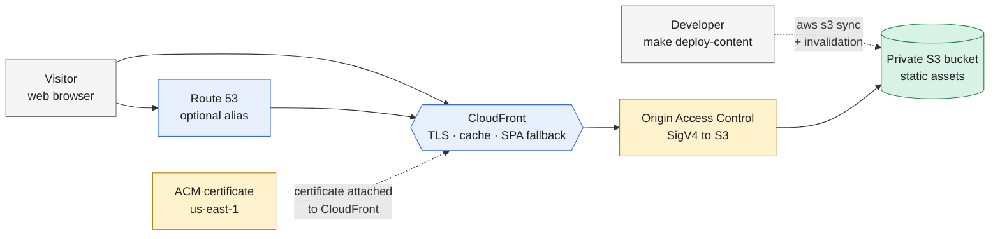

# Static Site — S3 + CloudFront

A production-style static website platform on AWS. The site files live in a
private S3 bucket, and CloudFront is the only public entry point. Terraform
owns the AWS infrastructure; the Makefile handles the separate content
deployment and cache-invalidation workflow.

This is an independent project: its Terraform state, variables, README, CI,
and lifecycle live under this directory and can move to a standalone
repository without changes.

## Current Status: Setup Only

This repository contains a reusable hosting foundation, not a complete
production website. The included `site/index.html` is a smoke-test page used to
verify the AWS path. The domainless configuration was applied and tested
through CloudFront, then fully destroyed; there are currently no hosted site
resources or real domain attached to this project.

Before calling a real website complete, follow the [Production Launch
Checklist](#production-launch-checklist). In particular, this project does not
yet provide a real application build, a custom domain, remote Terraform state,
production deployment automation, WAF rules, monitoring, alerting, or a
rollback runbook.

## Architecture



### How to read this diagram

**S3 is not a website endpoint.** The bucket has public access blocked and no
website hosting configuration. CloudFront reads it through an Origin Access
Control, and the bucket policy grants `s3:GetObject` only to this distribution.
That keeps the origin private and gives the site HTTPS, caching, and a single
public boundary.

**The custom domain is optional.** With `domain_name` unset, CloudFront's
generated hostname is enough to test the project. When a domain is supplied,
Terraform can request an ACM certificate in `us-east-1`, validate it through
Route 53 when the hosted zone is managed there, and create an alias record.

**The distribution supports single-page applications.** Requests for missing
paths receive the cached `index.html` response instead of an S3 error page.
The default root object and SPA fallback are separate from asset caching so the
HTML shell can be refreshed quickly while fingerprinted assets remain cached.

**Infrastructure and content have different lifecycles.** Terraform creates
the bucket and distribution. `make deploy-content` synchronizes a local
`site/` directory and invalidates only the HTML shell by default. The bucket
name and distribution ID come from Terraform outputs, so the content command
does not duplicate infrastructure configuration.

## What Gets Created

| Resource | Purpose |
|---|---|
| **S3 bucket** | Private origin for HTML, CSS, JavaScript, and other assets |
| **S3 versioning** | Protects against accidental overwrites and supports recovery |
| **S3 encryption** | Server-side encryption for objects at rest |
| **S3 public-access block** | Prevents public bucket/object access |
| **CloudFront OAC** | Signs origin requests with SigV4 |
| **CloudFront distribution** | Public HTTPS entry point, caching, compression, and SPA fallback |
| **CloudFront response headers policy** | Adds baseline security headers without application code |
| **ACM certificate** | Optional custom-domain certificate; always issued in `us-east-1` |
| **Route 53 records** | Optional alias records for the custom domain |

## Cache Policy

| Path | TTL strategy | Reason |
|---|---|---|
| Default/static assets | Long-lived (`31536000` seconds) | Fingerprinted assets can be cached at the edge |
| `/index.html` | No-cache | New deployments should become visible immediately after invalidation |
| SPA fallback response | No-cache | Client-side routes should receive the current application shell |

The content deployment command uploads `index.html` with a no-cache directive
and all other files with a one-year immutable cache directive. The Terraform
distribution also has a default invalidation path for `index.html`; pass an
explicit path when a deployment changes another unversioned file.

## File Structure

```text
static-site/
├── README.md
├── Makefile
├── .github/workflows/terraform.yml
├── main.tf                  # Terraform and provider configuration
├── variables.tf             # Project, region, domain, and tagging inputs
├── outputs.tf               # Bucket, distribution, and site endpoints
├── s3.tf                    # Private bucket, ownership, encryption, policy
├── cloudfront.tf            # OAC, distribution, cache behavior, headers
├── acm.tf                   # Optional us-east-1 certificate and validation
├── route53.tf               # Optional alias records
├── site/
│   └── index.html            # Minimal deployable example site
└── .gitignore                # Local Terraform and content artifacts
```

## Prerequisites

| Tool | Version | Check |
|---|---|---|
| Terraform | `>= 1.9` | `terraform --version` |
| AWS CLI | v2 | `aws --version` |
| AWS credentials | permissions for S3, CloudFront, ACM, and optionally Route 53 | `aws sts get-caller-identity` |

For a custom domain, the Route 53 hosted zone must already exist and be
managed by the AWS account used for the apply. CloudFront certificates must be
created in `us-east-1`; the bucket can use the configured `aws_region`.

## Implementation Order

Each step builds on the previous one. Run the local checks and commit after
each step.

| Step | Files | Creates |
|---|---|---|
| **1** | `README.md` | Architecture, security model, lifecycle, and implementation plan |
| **2** | `main.tf`, `variables.tf`, `outputs.tf` | Provider configuration and project inputs |
| **3** | `s3.tf` | Private bucket, encryption, versioning, ownership, and public-access block |
| **4** | `cloudfront.tf` | OAC, distribution, bucket policy, SPA fallback, cache policies, and security headers |
| **5** | `acm.tf`, `route53.tf` | Optional custom-domain certificate and alias records |
| **6** | `Makefile`, `site/index.html` | Content deployment, invalidation, and a smoke-test page |
| **7** | `.github/workflows/terraform.yml` | Project-local fmt, validate, and tflint checks |
| **8** | Root `README.md` | Add this project to the repository index |

## Workflow

```bash
# Infrastructure
make init
make plan
make apply

# Content
make deploy-content SITE_DIR=site
make invalidate

# Checks
make fmt
make validate
make lint

# Cleanup
make destroy
```

The default configuration does not require a domain and therefore exposes the
CloudFront hostname. A custom-domain deployment can use a variables file such
as:

```hcl
domain_name         = "www.example.com"
route53_zone_name   = "example.com"
create_dns_records  = true
```

Do not commit real `.tfvars` files or credentials. Use
`terraform.tfvars.example` as the documented input template.

## Production Launch Checklist

Complete these items in order when turning this learning setup into a real
website.

### 1. Prepare the Domain

- Register a domain with a registrar, or use an existing domain.
- Create a public Route 53 hosted zone in the AWS account that will run this
  project.
- Update the registrar to use the Route 53 name servers and wait for DNS
  delegation to propagate.
- Decide on one canonical hostname, such as `www.example.com` or
  `example.com`. The current variables configure one hostname; supporting both
  apex and `www` requires additional aliases and a redirect decision.
- Copy `terraform.tfvars.example` to `terraform.tfvars` and replace the
  example values:

```hcl
domain_name        = "www.example.com"
route53_zone_name  = "example.com"
create_dns_records = true
```

- Run `make plan` and confirm the plan includes the ACM certificate, DNS
  validation record, and the CloudFront alias before running `make apply`.
- Wait for ACM validation and DNS propagation. The certificate is created in
  `us-east-1` because CloudFront requires certificates from that region.

### 2. Replace the Smoke-Test Site

- Build the real frontend with its framework or static-site generator outside
  Terraform.
- Point `SITE_DIR` at the build output directory. That directory must contain
  `index.html` at its root:

```bash
make deploy-content SITE_DIR=dist
```

- Make sure JavaScript and CSS filenames are content-hashed before using the
  default one-year immutable cache directive.
- Review caching for files that are not hashed, including service workers,
  manifests, `robots.txt`, and `sitemap.xml`; update the Makefile if they need
  short-lived caching.
- Add application-specific metadata, favicon assets, accessibility checks,
  analytics decisions, and real error/empty states.
- Do not place API keys, credentials, or other secrets in browser-delivered
  files. Static hosting cannot protect a secret from visitors.

### 3. Add the Application Dependencies

- Add a separate backend for forms, authentication, payments, dynamic data, or
  other server-side behavior. This project only hosts static files.
- Configure the backend API origin, CORS policy, authentication, rate limits,
  and secret storage separately.
- Add S3 CORS configuration only when the browser must call S3 directly; normal
  page delivery through CloudFront does not require it.
- Confirm that the SPA fallback is appropriate for the application. The current
  403/404 mapping returns `index.html` for unknown paths, which can hide broken
  asset URLs unless those paths are tested separately.

### 4. Make State and IAM Production-Safe

- Move Terraform state from the local state file to a dedicated encrypted S3
  backend with versioning and state locking before a production apply.
- Bootstrap the state bucket and its access controls separately from this
  project. Do not make the production site depend on the state bucket being
  created by its own state.
- Use separate AWS accounts or environments for development and production
  when practical.
- Replace broad personal CLI permissions with least-privilege roles for
  Terraform and content deployment.
- Prefer GitHub Actions OIDC or another short-lived credential mechanism over
  long-lived AWS access keys.
- Add budgets, cost alerts, resource tags, and an ownership contact.

### 5. Build Deployment Automation

- Keep `terraform plan` and `terraform apply` behind an approval gate in CI.
- Add a CI job that builds the frontend, runs its tests, uploads the build
  output, and invalidates the changed CloudFront paths.
- Separate infrastructure changes from content deployments so a content update
  does not require a Terraform apply.
- Pin the build toolchain and dependencies, and retain build logs and the
  deployed commit identifier.
- Decide whether this nested workflow remains a portability check or whether a
  repository-root workflow should dispatch into `static-site/`. GitHub does not
  execute workflows nested under this parent repository; it will run this file
  automatically only after the project is moved to a standalone repository.

### 6. Add Production Security and Operations

- Add AWS WAF if the site is a meaningful public application; configure managed
  rules, rate limiting, and an allow/deny strategy appropriate to the app.
- Review and tighten the response security headers, especially the Content
  Security Policy, after the frontend dependencies are known.
- Enable CloudFront access logging and retain logs in a separate protected
  bucket if audit or incident investigation requires it.
- Add CloudWatch alarms for CloudFront 4xx/5xx rates, origin errors, and unusual
  request volume.
- Define retention and recovery expectations for S3 object versions. The
  current lifecycle removes noncurrent versions after 30 days.
- Document a rollback procedure. The current Makefile can deploy a selected
  build, but it does not automatically restore a previous application version.
- Test invalid paths, missing assets, cache behavior, HTTPS, headers, and
  browser functionality from outside the AWS account.

### 7. Production Acceptance Test

Run these checks after the domain and real build are configured:

```bash
make plan
make apply
make deploy-content SITE_DIR=dist

curl -I https://www.example.com/
curl -fsSL https://www.example.com/known-client-route
curl -I http://www.example.com/
```

Confirm the following before declaring the website live:

- The custom hostname resolves through Route 53.
- ACM is issued and CloudFront serves the expected certificate.
- HTTP redirects to HTTPS.
- The home page and client-side routes return the expected application.
- Direct S3 access is denied.
- HTML is not cached longer than intended.
- Fingerprinted assets have the expected long cache lifetime.
- Security headers are present and compatible with the application.
- A known previous build can be redeployed successfully.
- CI can reproduce and deploy the same build without personal credentials.

## Cost and Cleanup

CloudFront, S3 storage/requests, and Route 53 hosted-zone/query charges are
usage-based. ACM certificates are free when used with an integrated AWS
service. This project creates no NAT gateway or always-on compute, but a
CloudFront distribution can still incur small charges while serving traffic.

Run `make destroy` when the exercise is complete. S3 versioning can retain
older object versions, so the Makefile includes a separate `empty-bucket`
target for deliberate cleanup before destroying the bucket.

## Deliberate Scope Limits

- No WAF is included by default; add one when the site becomes a meaningful
  public application.
- Route 53 DNS validation assumes the hosted zone is in the same AWS account.
- The example content is intentionally minimal; application build tooling is
  outside Terraform's scope.
- A single CloudFront distribution is used; multi-region origin replication is
  not necessary for this learning exercise.
- The default CloudFront hostname is suitable for testing, not branding or
  search-engine launch requirements.
